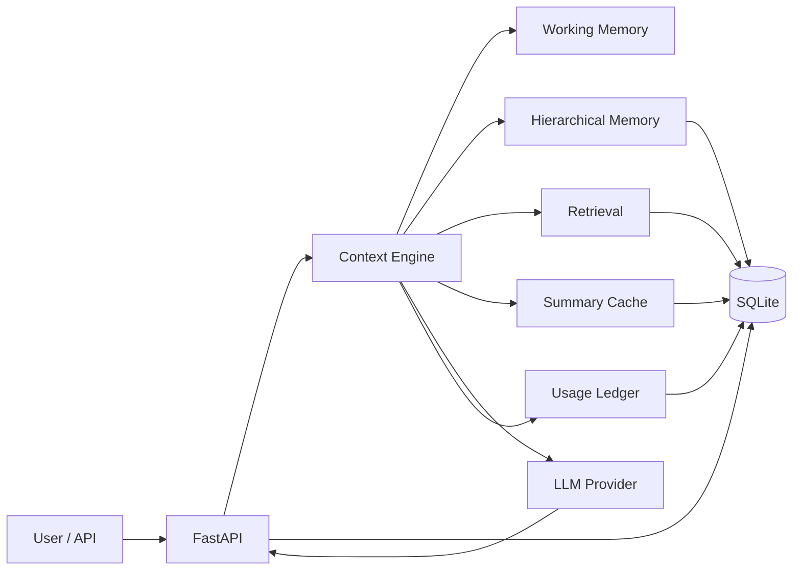

# LLM-Context-Optimization-Engine

**Context and memory optimization engine for long-running LLM applications.**

LLM-Context-Optimization-Engine evaluates how LLM systems should assemble context, retrieve memory, control token growth, and keep long sessions coherent. It is not a chatbot. It is an AI infrastructure project for context selection, hierarchical memory, retrieval quality, and cost instrumentation.

Current benchmark highlights:

- **10k-turn memory scaling**: importance-based memory improves critical recall from `0.1082` to `0.9072` under the same `600`-message budget as sliding window.
- **Adaptive context selection**: `0.8688` mean evidence quality with `78.71%` fewer context tokens than full history.
- **Retrieval evaluation**: BGE and OpenAI embedding-only retrieval reach `1.0000` Recall@6 and `1.0000` top-hit accuracy on the current stress suite.

## Problem

Long-session LLM applications fail for infrastructure reasons:

- Full-history prompts make cost and latency grow with every turn.
- Sliding windows reduce token use but forget older facts, constraints, and user preferences.
- Summaries can compress history, but they can drift or erase important details.
- Retrieval can recover older facts, but stale or noisy evidence can pollute the prompt.

## What It Does

- **Adaptive context selection** chooses full history, recent window, summary, retrieval, hybrid, or adaptive assembly based on the request and available evidence.
- **Hierarchical memory** separates working, episodic, semantic, and archived retrieval memory.
- **Importance scoring** ranks memories by recency, persistence, contradiction risk, retrieval frequency, entity importance, and preference durability.
- **Retrieval evaluation** compares BM25, embedding-only, and hybrid retrieval across mock, local, and API embedding backends.
- **Token/cost instrumentation** records foreground chat usage, background memory work, prompt-cache tokens, latency, and estimated cost.

## Architecture



At request time, LLM-Context-Optimization-Engine assembles the prompt from recent messages, cached summaries, retrieved evidence, pinned context, and the current user message. The context preview endpoint exposes exactly what will be sent to the model.

## Key Results

| Area | Result | Why it matters |
|---|---:|---|
| 10k-turn memory scaling | `0.1082 -> 0.9072` critical recall | Importance scoring preserves long-range facts under the same `600`-message budget as sliding window. |
| Adaptive context quality | `78.71%` fewer context tokens, `0.8688` mean quality | Adaptive context beats full-history mean quality while using far less context. |
| Retrieval quality | `1.0000` Recall@6 for BGE and OpenAI embeddings | Real embeddings outperform the deterministic baseline on semantic recall. |

Full tables and methodology are in [docs/evaluation.md](docs/evaluation.md), [docs/retrieval.md](docs/retrieval.md), and [docs/memory-scaling.md](docs/memory-scaling.md).

## Core Features

**Context Engineering**

- Token-aware context builder with full-history, sliding-window, summary, retrieval, hybrid, and adaptive policies.
- Incremental summarization with cached summaries and recent-message preservation.
- Context preview API for inspecting assembled prompts before the LLM call.

**Memory System**

- Memory importance scoring with preserve, compress, and evict actions.
- Hierarchical memory layers: working, episodic, semantic, and archived retrieval memory.
- Retrieval-frequency feedback loop that updates memory value after use.

**Retrieval Evaluation**

- BM25, embedding-only, and weighted hybrid retrieval modes.
- Embedding backends: deterministic `mock/hash`, local `bge-small-en-v1.5`, local `e5-base-v2`, and `openai/text-embedding-3-small`.
- Metrics: Recall@K, MRR, Precision@K, distractor hit rate, stale evidence rate, and top-hit accuracy.

**Observability / Cost Tracking**

- Usage ledger for chat calls, background summarization, prompt-cache tokens, latency, and estimated cost.
- Benchmark exports to JSON/CSV/PNG for repeatable result reporting.
- Offline deterministic tests plus optional live model-answer evaluation.

**Deployment**

- FastAPI backend with a lightweight dashboard.
- SQLite persistence for local development and reproducible benchmarks.
- Docker, docker-compose, and GitHub Actions CI.

## Quickstart

```powershell
python -m venv .venv
.venv\Scripts\activate
pip install -r requirements.txt
copy .env.example .env
python main.py
```

Open `http://localhost:9000`.

For local testing without provider keys, use the deterministic `mock/echo` model.

Optional local embeddings:

```powershell
pip install -r requirements-embeddings.txt
```

Useful evaluation commands:

```powershell
python eval_memory_quality.py --json --export
python eval_memory_scaling.py --turns 1000,5000,10000 --json --export
python eval_retrieval_quality.py --embedding-models mock/hash,local/bge-small-en-v1.5,local/e5-base-v2 --json --export
```

Docker:

```powershell
docker compose up --build
```

## Deep Dive

<details>
<summary>Memory scaling evaluation</summary>

Stress-tests `full_archive`, `sliding_window`, and `importance` policies on 1k, 5k, and 10k-turn synthetic sessions with retrieval noise, conflicting updates, evolving preferences, entity drift, and forgotten constraints.

```powershell
python eval_memory_scaling.py --turns 1000,5000,10000 --json --export
```

At 10k turns, the importance policy keeps the same `600` messages as sliding window but raises critical recall from `0.1082` to `0.9072`. Full methodology and tables: [docs/memory-scaling.md](docs/memory-scaling.md).

</details>

<details>
<summary>Retrieval-quality evaluation</summary>

Measures retrieval quality before prompt assembly across BM25, embedding-only, and hybrid retrieval.

```powershell
python eval_retrieval_quality.py --embedding-models mock/hash,local/bge-small-en-v1.5,local/e5-base-v2,openai/text-embedding-3-small --json --export
```

BGE and OpenAI embedding-only retrieval reach `1.0000` Recall@6 and `1.0000` top-hit accuracy on the current stress suite. Full methodology and tables: [docs/retrieval.md](docs/retrieval.md).

</details>

<details>
<summary>Live model-answer evaluation</summary>

Calls real providers and scores generated answers for recall, conflict, abstention behavior, token usage, cost, and latency.

```powershell
python eval_model_answers.py --model openai/gpt-4o-mini --json --export
python eval_model_answers.py --model google/gemini-3.1-flash-lite --strategies full_history,sliding_window,summary,adaptive --json --export
```

The current live set is a provider sanity check, not the strongest research claim. The offline memory-quality suite is harder and exposes more failure modes. Details: [docs/evaluation.md](docs/evaluation.md).

</details>

<details>
<summary>API endpoints</summary>

```text
GET    /                               dashboard
GET    /api/health                     service status
GET    /api/models                     configured model registry
POST   /api/chat                       non-streaming chat
POST   /api/chat/stream                streaming chat
GET    /api/messages/{session}         recent stored messages
GET    /api/context/{session}          context preview sent to the LLM
GET    /api/memory/{session}           hierarchical memory metadata
GET    /api/stats/{session}            token and cost accounting
GET    /api/summary/{session}          cached/generated summary
GET    /api/sessions                   saved sessions
POST   /api/set-story/{session}        pinned source context
DELETE /api/session/{session}          delete all session state
GET    /api/benchmark                  synthetic strategy benchmark
GET    /api/usage_timeseries/{session} per-day operation counts
```

</details>

<details>
<summary>Repo layout</summary>

```text
.
|-- main.py                    FastAPI app and endpoints
|-- context.py                 context building, summary, retrieval integration
|-- memory_importance.py       memory scoring and hierarchy assignment
|-- semantic_memory.py         vector indexing and retrieval
|-- database.py                SQLite persistence, usage ledger, memory metadata
|-- benchmark.py               synthetic token/cost benchmark
|-- eval_memory_quality.py     offline context-policy evaluation
|-- eval_memory_scaling.py     1k-10k turn memory scaling evaluation
|-- eval_retrieval_quality.py  retrieval ranking evaluation
|-- eval_model_answers.py      optional live provider answer evaluation
|-- docs/                      architecture and evaluation deep dives
|-- results/                   exported benchmark artifacts
|-- tests/                     deterministic unit tests
`-- requirements-embeddings.txt optional local embedding dependencies
```

</details>

## Documentation

- [Architecture](docs/architecture.md)
- [Evaluation](docs/evaluation.md)
- [Retrieval](docs/retrieval.md)
- [Memory scaling](docs/memory-scaling.md)
