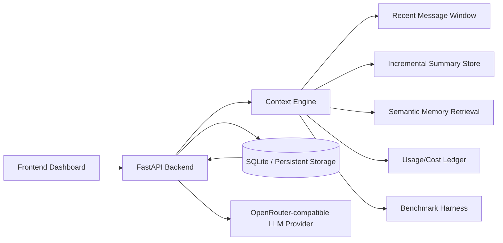

# ContextFlow AI — LLM Context Engineering Platform
**LLM Context Engineering Platform for Token-Efficient Memory, Semantic Retrieval, and Long-Session Optimization**

ContextFlow AI is an AI infrastructure project for **evaluating and optimizing how long-running LLM applications manage context, memory, token usage, and cost**. It is designed for measurable token/cost tradeoffs, memory strategy comparisons, and instrumentation for long-session behavior.

**This is not a chatbot product.** It’s a context optimization engine and research harness that compares strategies for keeping LLM sessions coherent and affordable as histories grow.

---

## Problem
Modern LLM apps degrade as sessions get long:

- **Cost and latency scale with context length** when you naively send full history.
- **Sliding windows** keep cost down but drop older facts.
- **Summarization** saves tokens but can introduce drift or lose detail.
- **Retrieval** can recover older facts but adds its own complexity (indexing, embeddings quality, and prompt integration).

---

## Solution
ContextFlow AI implements and evaluates multiple context strategies:

- **Full history baseline**: send everything (upper bound on coherence, worst for cost).
- **Sliding recent window**: last \(N\) messages only (token-efficient, forgetful).
- **Incremental summaries**: summarize older turns and cache the evolving memory.
- **Summary + semantic retrieval**: include incremental summaries plus retrieved prior facts relevant to the current prompt.

The system also tracks **foreground vs background** token/cost usage (chat calls vs memory maintenance calls like summarization/compression).

---

## Key Features
- **Token-aware context builder** (`context.py`)
- **Incremental summarization with caching** (older turns summarized, recent turns preserved verbatim)
- **Semantic memory retrieval module** (`semantic_memory.py`) with vector indexing + top‑k retrieval
- **Model-aware token counting** (tiktoken + fallback)
- **Usage & cost ledger** for chat + background memory operations (`llm_usage` table)
- **Context preview endpoint** (inspect what’s actually sent to the LLM)
- **Session stats endpoint** (tokens + cost breakdown)
- **Benchmark harness** with exports to **JSON/CSV/PNG** (`benchmark.py`)
- **Long-session evaluation script** scaffold (`eval_long_memory.py`)
- **OpenRouter-compatible provider** + **deterministic mock provider** (`mock/echo`) for offline tests
- **Docker + docker-compose** local deployment
- **GitHub Actions CI** that runs unit tests + benchmark export

---

## Why This Matters
Long-session LLM apps are an infra problem, not just a prompting problem:

- **Context cost**: input tokens often dominate and grow superlinearly with “send full history”.
- **Memory drift**: summarization can compress tokens but may lose constraints, preferences, or entities over time.
- **Long-session coherence**: sustained narratives, agent workflows, and multi-hour assistants require stable memory.
- **Retrieval tradeoffs**: RAG-style retrieval can reduce context while preserving facts, but requires good indexing and careful prompt integration.

ContextFlow AI makes these tradeoffs explicit and measurable.

---

## Research/Engineering Questions Explored
- How do **token and cost curves** differ across memory strategies as turns increase?
- What is the **true cost** once you include **background summarization/compression overhead**?
- How do we make memory strategies **inspectable** (context preview) rather than opaque?
- When does **retrieval** help vs harm (irrelevant snippets, prompt dilution)?
- How should we evaluate long-memory behaviors (recall, contradiction, drift) in a repeatable harness?

---

## Architecture

### High-level system



### Context composition (per request)
At request time, the backend constructs:

1) System prompt + pinned story context  
2) Incremental summary memory (if session is long)  
3) Retrieved prior snippets relevant to the current prompt (optional)  
4) Recent messages window  
5) Current user prompt  

You can inspect the exact assembled messages via the **context preview** endpoint.

---

## Context Strategies
The project currently compares:

- **`full_history`**: full conversation appended each request
- **`sliding_window`**: keep last \(N\) messages
- **`incremental_summary`**: cached summary + recent messages
- **`incremental_summary + retrieval`**: summary + retrieved older facts + recent messages (live app path)

Note: the benchmark harness currently runs the first three strategies; the live app path includes retrieval in the system prompt.

---

## Benchmarking
Run the synthetic benchmark:

```bash
python benchmark.py --turns 100 --words-per-message 90
```

Export artifacts for README/dashboard use:

```bash
python benchmark.py --json --export
```

Exports:
- `results/benchmark.json`
- `results/benchmark.csv`
- `results/benchmark.png`

### Real benchmark results (from this repo)
Generated with:

```bash
python benchmark.py --json --export
```

Run configuration:
- Model: `x-ai/grok-4-fast`
- Conversation: 100 turns (200 messages), 90 words/message

Notes:
- **Latency is not measured** in this synthetic benchmark (token/cost only).
- `incremental_summary` **includes background summary overhead** (`bg_input` / `bg_output`) in `total_tokens` and `estimated_cost_usd`.

| Strategy | Requests | Input tokens | Bg input | Bg output | Total tokens | Est. cost (USD) | Savings vs full |
|---------|---------:|-------------:|---------:|----------:|-------------:|----------------:|----------------:|
| `full_history` | 100 | 1,178,225 | 0 | 0 | 1,213,225 | 0.253145 | 0.00% |
| `sliding_window` | 100 | 180,393 | 0 | 0 | 215,393 | 0.053579 | 78.83% |
| `incremental_summary` | 100 | 326,654 | 21,341 | 3,774 | 386,769 | 0.088986 | 64.85% |

Exported artifacts:
- `results/benchmark.json`
- `results/benchmark.csv`
- `results/benchmark.png`

---

## Evaluation
This repo includes a **starter evaluation harness** for long-session recall:

```bash
python eval_long_memory.py --model mock/echo
```

Current evaluation scaffolding focuses on:
- **Long-range recall** (preference stated early, queried late)
- **Basic contradiction checks** (heuristic)
- **Latency measurement**

Planned evaluation directions (future work):
- **Entity consistency** and character/world-state continuity checks
- **Summary drift detection** (summary vs source messages)
- **Faithfulness** scoring for retrieved snippets vs ground truth
- Cost/latency normalization across models and providers

---

## Tech Stack
- **Python** (FastAPI, requests)
- **FastAPI + Uvicorn** (API + local server)
- **SQLite** (messages, summaries, pinned context, usage ledger, semantic memory vectors)
- **OpenRouter-compatible chat API** + **`mock/echo`** deterministic local mode
- **tiktoken** token estimation (+ fallback)
- **Matplotlib** benchmark chart export
- **Chart.js** dashboard charts (CDN)
- **Docker / docker-compose**
- **GitHub Actions** CI
- **unittest** (offline deterministic tests)

---

## Setup

### Local (venv)

```bash
python -m venv .venv
.venv\Scripts\activate
pip install -r requirements.txt
copy .env.example .env
```

Add your OpenRouter key to `.env`:

```text
OPENROUTER_API_KEY=your_key_here
```

Run:

```bash
python main.py
```

Open `http://localhost:9000`.

Tip: for local testing without an API key, select **`mock/echo`** in the model dropdown.

### Docker

```bash
docker compose up --build
```

---

## API Overview

```text
GET    /                               dashboard
GET    /api/health                     service status
GET    /api/models                     configured model registry
POST   /api/chat                       non-streaming chat
POST   /api/chat/stream                streaming chat
GET    /api/messages/{session}         recent stored messages
GET    /api/context/{session}          context preview sent to the LLM
GET    /api/stats/{session}            token and cost accounting
GET    /api/summary/{session}          cached/generated summary
GET    /api/sessions                   saved sessions
POST   /api/set-story/{session}        pinned source context
DELETE /api/session/{session}          delete all session state
GET    /api/benchmark                  synthetic strategy benchmark (for charts)
GET    /api/usage_timeseries/{session} per-day operation counts (e.g. summary)
```

---

## Results
This repo is set up to generate **real artifacts** (`results/benchmark.*`) that you can embed into the README and dashboard.

- **Full history** is the most expensive because each request grows with the entire conversation.
- **Sliding window** is the cheapest because it caps context length (but it would forget older facts by design).
- **Incremental summary** lands in between: it reduces long-history growth while paying **background summarization overhead** (tracked as `bg_input`/`bg_output`), which is why it’s more expensive than a pure sliding window in this run.

---

## Limitations 
- **Semantic memory embeddings** currently use a **local deterministic hashing embedding** to keep CI offline and the pipeline reproducible. This demonstrates the **retrieval architecture**, not state-of-the-art embedding quality.
- The **evaluation harness** is an engineering test scaffold, **not a peer-reviewed scientific benchmark**.
- Cost numbers depend on **model pricing configuration** and provider reporting; estimates are used when usage data is unavailable.
- “Production-ready” hardening (observability, auth, multi-tenant isolation, load testing) is **out of scope** for this repo as-is.

---


## Repo Layout

```text
.
├── main.py                 FastAPI app and endpoints
├── context.py              context building + incremental summary + retrieval integration
├── semantic_memory.py       vector indexing + retrieval (demo/local embedding mode)
├── llm_utils.py             OpenRouter + mock provider, timeout/retry handling
├── database.py              SQLite persistence + usage ledger + memory vectors
├── benchmark.py             synthetic benchmark + JSON/CSV/PNG export
├── eval_long_memory.py      long-session recall evaluation scaffold
├── index.html               dashboard UI (context preview + charts)
├── tests/                   deterministic unit tests
├── Dockerfile
├── docker-compose.yml
├── .github/workflows/test.yml
└── requirements.txt
```
