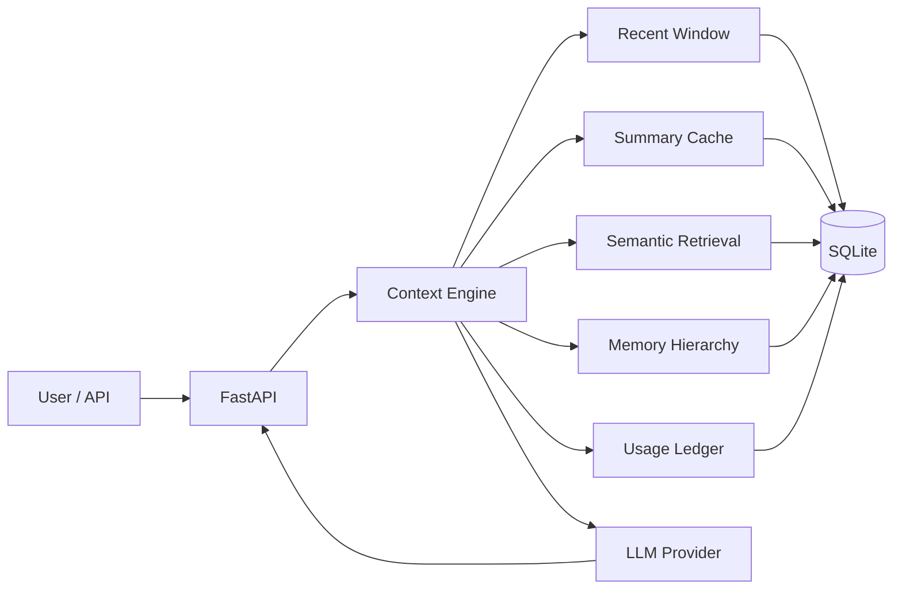

# Architecture

LLM-Context-Optimization-Engine is organized around one question: what should be sent to the LLM on this request, and why?

## Request Flow



## Core Components

**FastAPI backend**  
Serves chat, streaming chat, context preview, memory hierarchy inspection, benchmark results, and usage stats.

**Context engine**  
Builds model input from pinned context, summaries, retrieval snippets, recent messages, and the current user request.

**Summary cache**  
Stores incremental summaries for long sessions so older turns do not need to be resent verbatim.

**Semantic retrieval**  
Indexes messages and ranks candidate memories with BM25, embedding-only, or hybrid retrieval.

**Memory hierarchy**  
Assigns each indexed memory to working, episodic, semantic, or archived retrieval memory.

**Usage ledger**  
Tracks foreground chat usage, background memory operations, prompt-cache tokens, latency, and estimated cost.

## Context Policies

- `full_history`: sends the full conversation.
- `sliding_window`: sends only the most recent messages.
- `summary`: sends cached summary plus recent messages.
- `retrieval`: sends retrieved older evidence plus recent messages.
- `hybrid`: sends summary, retrieved evidence, and recent messages.
- `adaptive`: selects summary, retrieval, or both based on query intent and retrieval evidence.

## Prompt Assembly

For each request, LLM-Context-Optimization-Engine can assemble:

1. System prompt and pinned story/context.
2. Incremental summary memory if the session is long.
3. Retrieved prior facts relevant to the current query.
4. Recent messages.
5. Current user message.

The endpoint `GET /api/context/{session}` exposes the exact message list before the model call.

## Memory Hierarchy

Each indexed message receives:

- `importance_score`
- `memory_layer`
- `memory_action`
- per-signal scoring metadata

Layers:

- **Working memory**: recent turns.
- **Episodic memory**: events, incidents, decisions, releases, deadlines, and temporal updates.
- **Semantic memory**: durable facts, user preferences, entities, constraints, and project state.
- **Archived retrieval memory**: low-value or stale material that should not dominate active context.

Actions:

- **Preserve**: high-value memory that should remain available.
- **Compress**: useful memory that should be retained compactly.
- **Evict**: low-value, stale, or noisy memory under constrained budgets.

Inspect hierarchy metadata:

```text
GET /api/memory/{session}
```

## Storage

The current implementation uses SQLite for reproducibility and local development:

- `messages`: stored turns.
- `summaries`: cached summaries by message coverage.
- `memory_vectors`: indexed vectors by embedding model.
- `memory_metadata`: importance score, layer, action, retrieval count, and scoring signals.
- `llm_usage`: token/cost/latency ledger.

SQLite is intentional for the current evaluation harness. For a production deployment, the natural upgrade path is Postgres plus pgvector or Qdrant, with Redis for cache and background workers for summarization/indexing.
